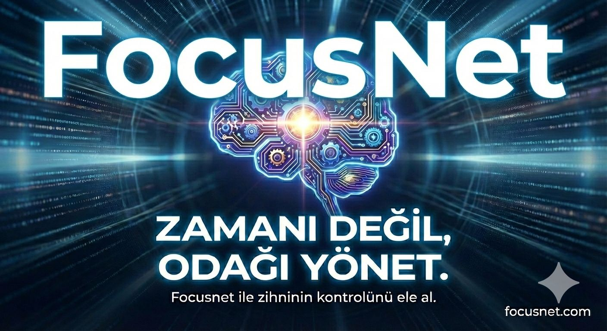

# FOCUSNET

## PROJE HAKKINDA

**Proje Tanımı:** 
Geleneksel ders çalışma rutinini dinamik ve sosyal bir dijital deneyime dönüştüren yeni platformumuzla tanışın! Bu yenilikçi web uygulamasında kendi belirlediğiniz günlük çalışma hedeflerini adım adım tamamlayıp ilerleme yüzdenizi %100'e taşırken, her gün masaya oturma alışkanlığınızı kırılmaz 'streak' zincirleriyle ödüllendireceksiniz. Üstelik bu yolda asla yalnız değilsiniz; arkadaşlarınızı ekleyerek kimin ne kadar çalıştığını görebilir, aranızda yaratacağınız tatlı bir rekabetle motivasyonunuzu her an zirvede tutabilirsiniz. Disiplini bir oyuna, odaklanmayı ise paylaşılan bir başarıya dönüştüren bu yeni nesil dijital çalışma alanında hedeflerinize ulaşmak artık çok daha keyifli!

**Proje Kategorisi:** 
Eğitim

**Referans Uygulama:** 
https://www.tusdata.com/

## Proje Linkleri

- **REST API Adresi:**
- **Web Frontend Adresi:**

  ## Proje Ekibi

**Grup Adı:**  COREX

**Ekip Üyeleri:** 
-Merve Varlıbaş
-Dilan Alma
